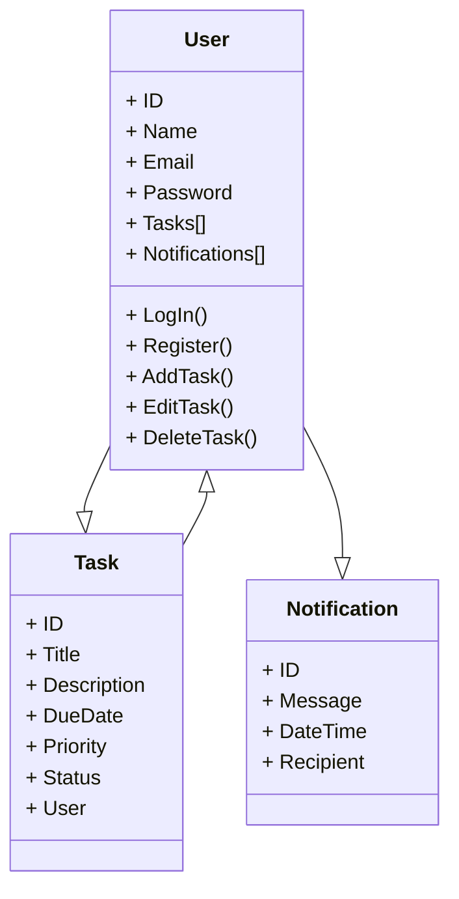

```mermaid
classDiagram
  class User {
    + ID
    + Name
    + Email
    + Password
    + Tasks[]
    + Notifications[]
    + LogIn()
    + Register()
    + AddTask()
    + EditTask()
    + DeleteTask()
  }

  class Task {
    + ID
    + Title
    + Description
    + DueDate
    + Priority
    + Status
    + User
  }

  class Notification {
    + ID
    + Message
    + DateTime
    + Recipient
  }

  User --|> Task
  User --|> Notification
  Task --|> User

```

Print rodando os testes:

Alunos:

* Pedro Henrique Moreira de Albuquerque
* Amabiel Junior
* Alan Mendonça
* Andre Lessa
* Marcos Filipi

